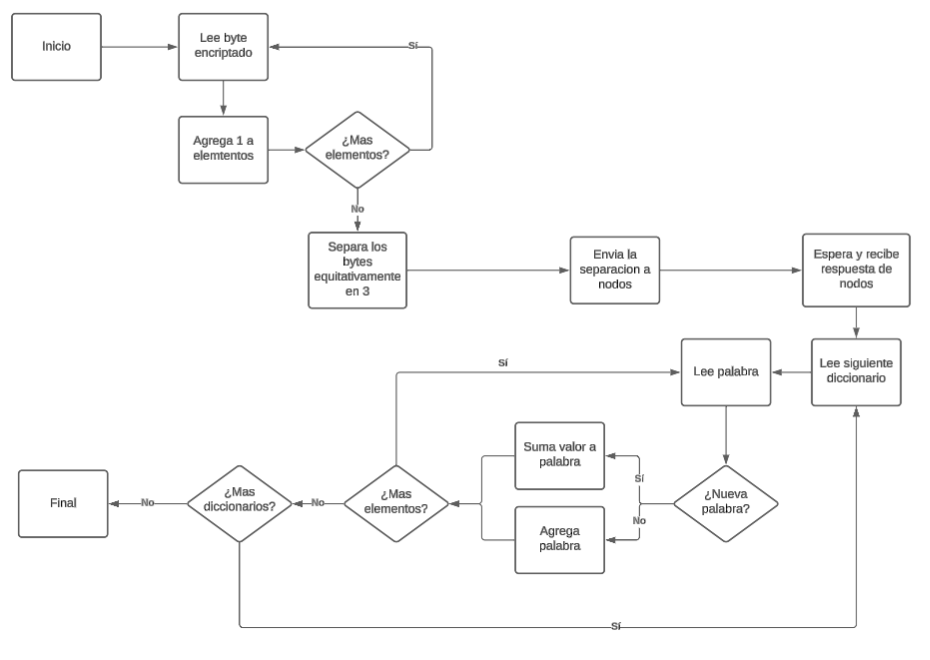

Introducción: 
    En computación, los drivers o controladores, son programas de software que permiten que el sistema operativo se comunique con el hardware (como tarjetas de video, impresoras, etc.), actuan como interpretes y son los encargados de traducir las instrucciones del sistema operativo y enviarlas al hardware para que pueda realizar la tarea. Sin los drivers adecuados, el hardware no funcionaría correctamente, ya que no habría una forma de comunicar el sistema operativo con el dispositivo.
    Se prosigue con las librerias o bibliotecas, estas son un conjunto de funciones o código preescrito que se puede utilizar para simplificar el desarrollo de software, evitando la necesidad de escribir código desde cero para tareas comunes.
    Ahora un Server-cluster, es un grupo de nodo conectados, en el caso de este proyecto, de manera centralizada a un nodo central, donde cada uno trabajan juntos como una sola unidad para aumentar el rendimiento, la disponibilidad y la escalabilidad de las aplicaciones.
    Finalmente: la encriptación es el proceso de convertir información legible en un formato ilegible, conocido como texto cifrado, para protegerla de accesos no autorizados.

    En este proyecto se intenta abarcar todos los elementos previamente mencionados, el proyecto consiste en que un server-cluster tome un texto cifrado enviado por un cliente, lo divida en 3 nodos que trabajaran de manera independiente para mejorar rendimiento, estos 3 nodos desencriptaran usando una llave, con el texto desencriptado los nodos contaran las apariciones de cada palabra y lo agregaran a un diccionario, estos diccionarios seran enviados devuelta al servidor central que contara la cantidad de palabras total y devolvera la palabra con mayor cantidad de apariciones en el documento, con esa palabra usara una libreria que se comunicara con un driver que a su vez se comunicara con un hardware que consiste en una simulacion de mano mecanica con un lapiz que dibujara la palabra obtenida en una superficie y su cantidad de apariciones.

    Se espera total funcionamiento del proyecto, con el resultado de la palabra con mayor cantidad de iteraciones en el documento cifrado 

Ambiente de desarrollo: 
    Se usa esta trabajando en un sistema operativo "Linux", "Ubuntu 22.02", localizado en un particion de disco con arranque dual con "Windows 11".
    Se esta utilizando el uso combinado de lectores de texto y "Visual Studio Code" para la ediccion del codigo.
    Se esta utilizando "gcc" y "mpicc" como compiladores para el proyecto, ademas del uso de make y otros.
    Se esta utilizando "GitHub" para almacenamiento del proyecto y "GitHub desktop" para el trabajo de commits.
    Se esta utilizando como archivos txt de prueba de "GitHub":
        https://gist.github.com/jsdario/6d6c69398cb0c73111e49f1218960f79     // Don Quijote de la Mancha, Parte 1
        https://gist.github.com/jsdario/9d871ed773c81bf217f57d1db2d2503f     // Don Quijote de la Mancha, Parte 2
        https://raw.githubusercontent.com/uracilo/testdata/master/odisea.txt // La Odisea

    Se esta utilizando las siguientes librerias usadas: 
        <mpi.h>    // MPI
        <stdio.h>  // Herramienta basica del proyecto
        <stdlib.h> // Herramienta basica del proyecto
        <string.h> // Herramienta basica del proyecto
        <ctype.h>  // Herramienta basica del proyecto

Detalles de diseño:
    El encriptado consiste en una encriptacion de llave, donde cada elemento del texto de entrada se le aplica la operacion XOR, en caso de que ya no se tenga mas elementos en la llave, se empieza desde el primer elemento de la llave de nuevo, esta operacion sirve para encripcion y desencripcion puesto que es una operacion que se puede invertir.

    Como se tiene que similar multiples nodos en una misma computadora debido a la falta de recursos, se opta por simular nodos en la misma computadora pero usando MPI como metodo de comunicacion entre nodos, para intentar mantener la caracteristica de paralelismo real.

    El funcionamiento del servidor consiste en contar la cantidad de bytes del texto encriptado, los separa equitativamente en cada nodo, donde el nodo 1 toma la parte 1 del texto, el nodo 2 de la parte 2 del texto, y a si sucesivamente, cuando recibe los diccionarios, se tienen 3 separados, se necesita que este compinado para el conteo final, se recorre cada diccionario y cada palabra, agregando estas palabras o sumando el valor a la palabra en caso de que ya se encuentre en el diccionario principal, cuando recorre todos los elementos, recorre por ultima vez el diccionario prinpipal para optener el resultado final, se ve como el siguiente diagrama.

    
La libreria constara de varias funciones lo mas simple y modulado posible para mantener buenas practicas de programacion, cada modulo tiene que ser documentado en su titulo para explicar su funcionamiento y solo documentar el codigo si es fundamental para su funcionamiento.
